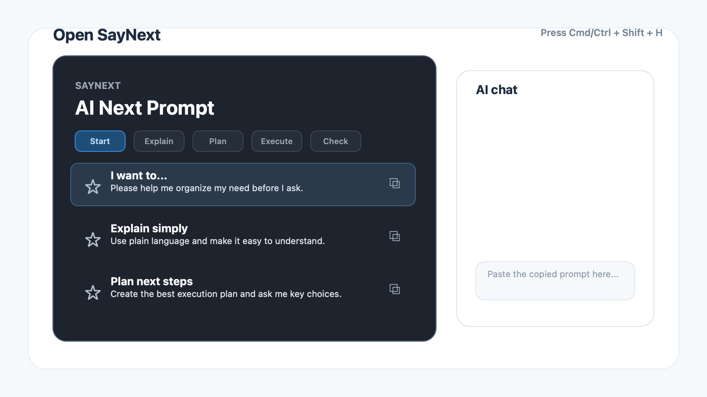
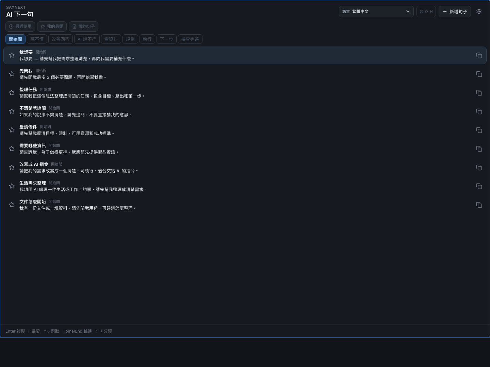

# SayNext

An open-source desktop palette that helps people ask AI the next better question.

[](https://github.com/Leo-hypno/saynext/actions/workflows/ci.yml)
[](https://github.com/Leo-hypno/saynext/releases/latest)
[](LICENSE)
[](https://github.com/Leo-hypno/saynext/releases/latest)
[](https://github.com/Leo-hypno/saynext/releases/latest)
[](https://tauri.app/)

When ChatGPT, Claude, Gemini, Codex, or any AI tool gives a confusing answer, refuses too early, or you simply do not know what to ask next, press a hotkey and pick a rescue prompt.

> SayNext is not a prompt manager for people who already know what they want to ask.
> It is built for the moment before that.

## Download

Most users only need one installer:

| System | One-click download |
| --- | --- |
| Mac Apple Silicon | [Download DMG](https://github.com/Leo-hypno/saynext/releases/download/v0.1.7/SayNext-0.1.7-darwin-aarch64-dmg.dmg) |
| Mac Intel | [Download DMG](https://github.com/Leo-hypno/saynext/releases/download/v0.1.7/SayNext-0.1.7-darwin-x64-dmg.dmg) |
| Windows | [Download EXE](https://github.com/Leo-hypno/saynext/releases/download/v0.1.7/SayNext-0.1.7-windows-x64-nsis-setup.exe) |

[Open the latest release page](https://github.com/Leo-hypno/saynext/releases/latest) if you need checksums, MSI, updater files, or older versions.

macOS builds are signed and notarized. If Windows blocks the installer, choose "More info" then "Run anyway".

## 30-Second Flow



1. Press `Cmd/Ctrl + Shift + H` to open SayNext.
2. Pick the situation you are in: start, confused, planning, execution, review.
3. Click a prompt, or press `Enter`, to copy it.
4. Paste it into ChatGPT, Claude, Gemini, Codex, or any AI chat box.



## Who It Is For

- AI beginners who freeze after a confusing answer.
- People using AI for documents, reports, travel plans, writing, learning, and daily work.
- Codex users who want clearer instructions, planning prompts, execution prompts, and review prompts.
- Teachers, coaches, teams, and communities that want beginner-friendly AI habits.
- Contributors who want to improve prompt packs without touching app code.

## Why

AI beginners often give up when the model answers badly, explains poorly, or says "I cannot" too quickly.

SayNext gives them short, human rescue prompts that keep the conversation moving across coding, writing, planning, documents, reports, travel, and everyday life.

## How It Works

1. Press `Cmd/Ctrl + Shift + H` to show SayNext.
2. Choose a context, or use recent, favorites, or your own prompts.
3. Click a prompt, or use arrow keys and press Enter.
4. Paste into ChatGPT, Claude, Gemini, or any AI chat box.

SayNext stays local. It does not call an AI API and does not send analytics.

## Highlights

- Global hotkey palette
- Native macOS / Windows window controls
- Click or press Enter to copy
- Beginner-friendly rescue prompts
- Context tabs for common AI conversation moments
- Next-step prompts for moving a conversation forward
- Favorites, recent prompts, and custom prompts
- Manual light / dark / system appearance setting
- Remembered window position
- Offline-first, no account, no AI API key, no tracking
- Local JSON prompt packs
- Built with Tauri, React, and TypeScript

## Demo

The core flow is simple: open SayNext, click a prompt, paste it into ChatGPT, Claude, Gemini, or Codex.

See [docs/demo.md](docs/demo.md) for the product flow, screenshot plan, and assets used by the GitHub homepage.

## Project Status

SayNext is in early public release. macOS and Windows installers are available on GitHub Releases, and in-app updates are available starting from `v0.1.1`.

macOS builds are signed and notarized starting from `v0.1.3`. Windows builds are not code-signed yet, so Windows may show a SmartScreen warning.

## Keyboard Flow

- `← / →`: switch categories
- `↑ / ↓`: select a prompt
- `F`: favorite or unfavorite the selected prompt
- `Esc`: close settings or leave text editing
- `Enter`: copy the selected prompt

## Prompt Packs

Prompt packs live in `packs/`.

```text
packs/
├── de/
│   └── beginner-rescue.json
├── zh-TW/
│   └── beginner-rescue.json
├── en/
│   └── beginner-rescue.json
├── es/
│   └── beginner-rescue.json
├── fr/
│   └── beginner-rescue.json
├── ja/
│   └── beginner-rescue.json
├── ko/
│   └── beginner-rescue.json
└── pt-BR/
    └── beginner-rescue.json
```

SayNext currently includes prompt packs for English, Traditional Chinese, Japanese, Korean, Spanish, French, German, and Brazilian Portuguese.

Each pack is a simple JSON file, so non-programmers can contribute better translations, new languages, and better rescue prompts.

See [Prompt Pack Schema](docs/prompt-pack-schema.md).

## Contribute A Prompt Pack

SayNext is especially friendly to non-code contributions:

1. Open a [prompt pack issue](https://github.com/Leo-hypno/saynext/issues/new?template=prompt_pack.md).
2. Suggest a new language, a better translation, or a real-life AI use case.
3. Keep prompts short, human, and useful when someone is stuck.

Prompt packs live in `packs/`, and the schema is documented in [docs/prompt-pack-schema.md](docs/prompt-pack-schema.md).

## Contributing

Contributions are welcome, especially prompt packs. You do not need to write code to help.

Good first contributions:

- Add a new language prompt pack
- Improve existing rescue prompts
- Translate the README or docs
- Test Windows tray behavior
- Create screenshots or a demo GIF
- Improve accessibility labels

See [CONTRIBUTING.md](CONTRIBUTING.md).

## Release

Download the latest public release from [GitHub Releases](https://github.com/Leo-hypno/saynext/releases/latest).

Preparing a future release? See [GitHub Launch Checklist](docs/github-launch-checklist.md).
For versioning and GitHub Releases, see [Release Guide](docs/release.md).

## Development

Prerequisites:

- Node.js 24+
- npm
- Rust toolchain, required for running Tauri

Install dependencies:

```bash
npm install
```

Run the desktop app after Rust is installed:

```bash
npm run dev
```

Run the web UI only:

```bash
cd apps/desktop
npm run dev:web
```

Run the full local check:

```bash
npm run check
```

Build a local desktop installer:

```bash
npm run bundle
```

Update SayNext's version before a release:

```bash
npm run version:set -- 0.1.7
```

Validate prompt packs only:

```bash
npm run validate:packs
```

Generate the local development icon:

```bash
npm run make:icon
```

## Roadmap

- [x] Product definition
- [x] Prompt pack schema
- [x] Traditional Chinese beginner rescue pack
- [x] English beginner rescue pack
- [x] Common language prompt packs
- [x] Desktop MVP UI
- [x] Prompt pack validation
- [x] Tauri global hotkey wiring
- [x] Clipboard integration
- [x] Tray/menu bar integration
- [x] Tray/menu bar close behavior
- [x] Native window controls and remembered position
- [x] Minimal settings panel
- [x] Settings persistence
- [x] Custom prompts
- [x] Manual appearance setting
- [x] macOS and Windows release builds
- [x] In-app updater foundation
- [x] README screenshot
- [x] Demo GIF
- [x] First-run onboarding tips
- [ ] Prompt pack loader from local folder

## License

MIT
